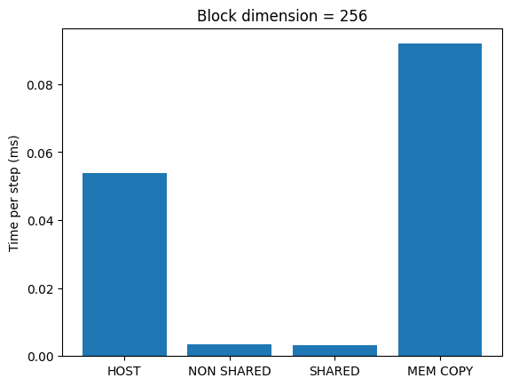
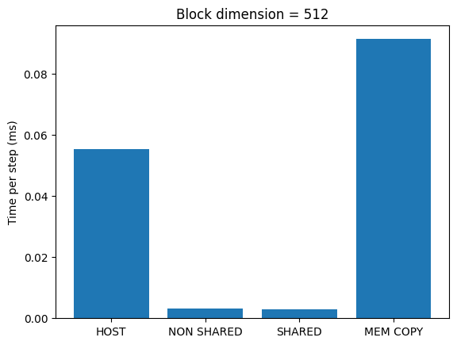
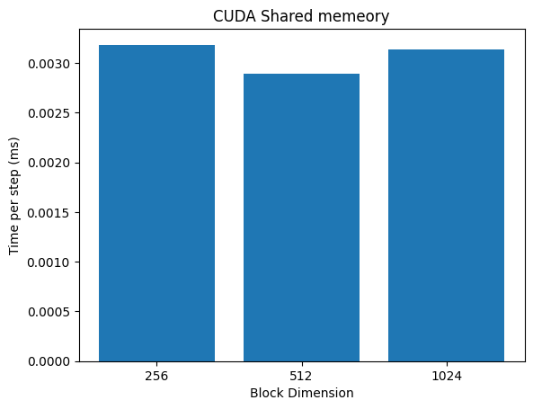

# Project 5: GPU Computing with CUDA

## Warm-up

In this project,  you will write 2 CUDA kernels for doing heat diffusion in one
dimension. The first kernel will be a naive implementation, the second kernel
will leverage CUDA shared memory. Be sure to watch and read the material in the [associated pre-class assignments](../schedule.md)! Then, as you are developing and running your CUDA code, refer to the following ICER documentation pages for using GPUs on HPCC:

- [Compiling for GPUs](https://docs.icer.msu.edu/Compiling_for_GPUs/)
- [Requesting GPUs](https://docs.icer.msu.edu/Requesting_GPUs/)

I strongly recommend using HPCC for this project.

## Part 1

Write a naive implementation of the heat diffusion approximation in
CUDA, using the `host_diffusion` routine in the `diffusion.cu` starter code  as a guide.

All the lines that you will need to change have been denoted with a FIXME. In
addition to writing the kernel, you will also need to handle the allocation of
memory on the GPU, copying memory to and from the GPU, launching the CUDA
kernel, and freeing the GPU memory. Remember to consider how large your domain
is vs. how many points your kernel needs to run on. To make things easier, you
can assume that the domain size minus `2*NG` will be divisible by the block
size, which will be divisible by 32.

These kernels will be easiest to debug by running only for 10 time steps. I've
included a python file to plot the difference between the host kernel and CUDA
kernel for the first time step. Any differences between the two should look
randomized and small. When you think you have your kernel working, you can run
it for 1000000 steps (since this simple implementation of heat diffusion
converges slowly).

I've also included a debugging function in the C version that you can use to
wrap your calls to the CUDA library, such as `checkCuda(cudaMemcpy(...));`. You
can see were I got this and some examples of how this is used
[here](https://github.com/parallel-forall/code-samples/blob/master/series/cuda-cpp/finite-difference/finite-difference.cu).
You need to activate this debugging function at compile time by executing 
`nvcc diffusion.cu -DDEBUG -o diffusion`.

The CUDA blog posts on finite difference in
[C/C++](https://devblogs.nvidia.com/finite-difference-methods-cuda-cc-part-1/)
might also be useful.

## Part 2

Rewrite your naive implementation of the heat diffusion kernel to first load
from global memory into a buffer in shared memory.

It will probably be useful to have separate indices to keep track of a thread's
position with it's shared memory block and within the entire array. You will
need extra logic to load in ghost zones for each block, and some calls to
`__syncthreads()`. When you get to calculating the diffusion in the kernel, all
memory loads should be from shared memory.

This kernel should give identical results to the `cuda_diffusion` kernel.

## Part 3

Time your naive implementation, the shared memory implementation, and a case
where memory is copied on and off the GPU for every time step.

Uncomment and fill in the code to test `shared_diffusion` but with copying data
to and from the GPU between every time step. This is closer to how CUDA is
sometimes used in practice, when there is a heavily used portion of a large
legacy code that you wish to optimize.

Increase your grid size to `2^15+2*NG` and change the number of steps you take
to 100. Run the program and take note of the timings. 

## What to turn In

Your code, well commented, and answers to these questions:

1. Report your timings for the host, naive CUDA kernel, shared memory CUDA kernel,
and the excessive memory copying case, using block dimensions of 256, 512,
and 1024. Use a grid size of `2^15+2*NG` (or larger) and run for 100 steps (or
shorter, if it's taking too long). Remember to use `-O3`! 

The times shown below are the time taken per step in milliseconds and they are averaged over five trials.

| Grid size | Block dimension | Host | Naive CUDA kernel | Shared memory CUDA kernel | Memory copying case |
|:----------:|:----------:|:----------:|:----------:|:----------:|:----------:|
| 32772 | 256 | 0.053775 | 0.003415 | 0.003183 | 0.091907 |
| 32772 | 512 | 0.055205 | 0.003242 | 0.002891 | 0.091322 |
| 32772 | 1024 | 0.055518 | 0.003274 | 0.003133 | 0.090563 |

All the different block dimensions seem to follow the same trend.

2. How do the GPU implementations compare to the single threaded host code. Is it
faster than the theoretical performance of the host if we used all the cores on
the CPU?

The GPU implementations - niave CUDA kernel and shared memory cuda kernel are much faster in comparison to the threaded host code. But the memory copying case is slower than the host code.

3. For the naive kernel, the shared memory kernel, and the excessive `memcpy` case,
which is the slowest? Why? How might you design a larger code to avoid this slow down?

The excessive memory copy kernel is the slowest, since for every step, the data is first copied from the host to the cuda device and at the end of the step, the updated data, to be used in the next step, is copied from CUDA device to the host. 

But this approach is very common in practice, especially in data heavy and compute intensive applications such as deep learning. This would be a good strategy, if the time taken by computation between memory copies are much higher than the time required to copy the data.

4. Do you see a slow down when you increase the block dimension? Why? Consider
that multiple blocks may run on a single multiprocessor simultaneously, sharing
the same shared memory.

Yes, there is a slowdown when the block size is increased from 512 to 1024, but the performance is better when the block dimension increases from 256 to 512 in the shared memory case. The reasons for the slowdown could be as follows:

1. Data has to be copied from the global memory to the shared memory.
2. When two threads are trying to access the same data, there could be banking conflicts.